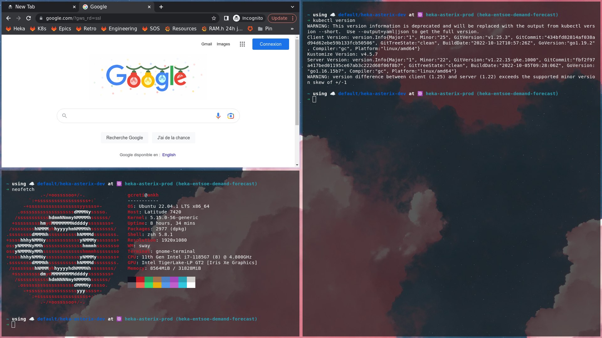

# ✨ kabooboo's dotfiles

This repository holds the dotfiles for my rice.

Rice was done to explore a tiling WM and to explore wayland.



## Software installed

I installed the following pieces of software:

```markdown
- sway
- waybar
- rofi
- mako
- grim & slurp
- swaylock-effects
- wps
- gcloud-sdk
- vlc
- peek
- obs-studio
- fzf
- vscode
- rofi
- zsh & oh-my-zsh & spaceship
- chrome
- kubectl & kubens & kubectx
- neofetch
- curl
```

## Software removed

By default, I remove the following software from ubuntu

```md
- snapd
```

## Wallpaper

Wallpaper was found by exploring a `vaporwave` thread of `wg` (_Wallpaper General_) in that infamous image board. (Will not share due to eventual copyright © issues.)
